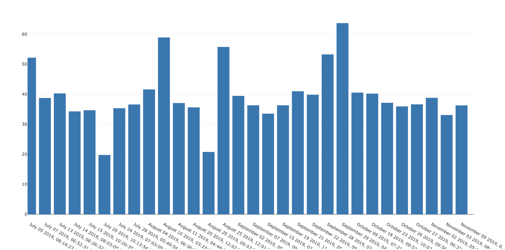

# (unofficial) nike_api

## Fetch Your Workout data from Nike (unofficial) api

### Installation
(Recommended) You'll only need docker installed

Or you can setup a virtual env with the pip requirements installed locally, and execute the same scripts called in `scripts/get_workouts.sh`

### Steps
1.  Go to https://www.nike.com/member/profile and login
1.  (This part is Annoying) Open Chrome Dev tools, click Network, search NIKE.COM, under "Headers" copy the authorization 'bearer' value and copy it to 'bearer_token.txt'. You may need to refresh the page with tools still open.
1.  Run `./scripts/get_workouts.sh`
1.  And finally, open nike-workouts.html in Chrome
